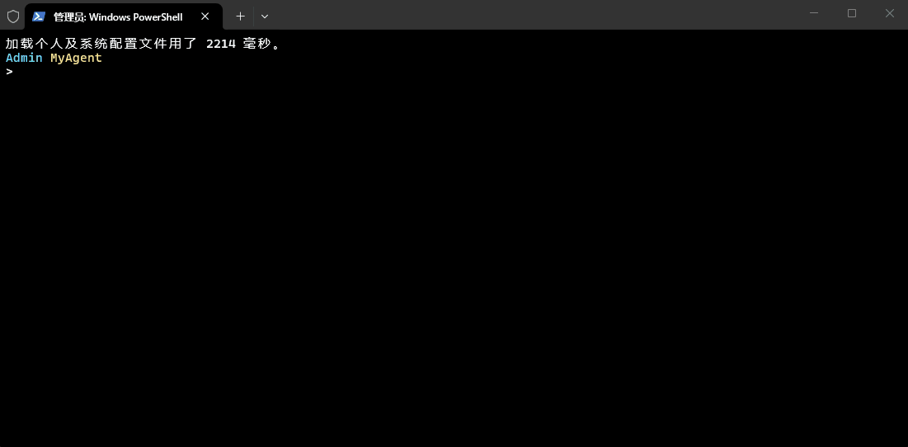

# AgentForge

> **智能任务自动化框架** - 基于 Claude Code 架构的现代 Agent 框架

[](https://python.org)
[](LICENSE)
[](https://github.com/lyz-wave/agentforge)
[](https://github.com/lyz-wave/agentforge/stargazers)
[](https://github.com/lyz-wave/agentforge/network/members)
[](https://github.com/lyz-wave/agentforge/issues)

---

<p align="center">
  
</p>

<p align="center">
  <em>AgentForge CLI 交互演示</em>
</p>

---

## 📖 项目简介

AgentForge 是一个基于 Claude Code 架构设计的智能 Agent 框架，实现了完整的 **Harness Engineering** 模式。它将 Agent 的核心能力（感知、推理、行动）与运行环境（工具、知识、权限）分离，提供了高度可扩展的 Agent 开发框架。

**核心理念：** Agency 来自模型，Harness 给 Agency 一个落脚点。

### 🎯 项目亮点

- ✅ **Agent Loop 核心循环** - 基于 `while True` + `stop_reason` 的最小可运行内核
- ✅ **8 个核心模块** - 工具系统、权限系统、Hook 扩展、任务规划、记忆系统、团队协作、MCP 集成
- ✅ **三道闸门安全机制** - 拒绝列表 → 规则匹配 → 用户审批
- ✅ **跨会话记忆系统** - SQLite 持久化 + 上下文压缩
- ✅ **多 Agent 协作** - 消息总线 + 异步邮箱 + 权限冒泡
- ✅ **MCP 协议支持** - 可扩展外部工具
- ✅ **CLI 交互界面** - 像 Claude Code 一样在命令行里启动并交互
- ✅ **4,600+ 行代码** - 完整的框架实现

---

## 🚀 快速开始

### 安装

```bash
# 克隆项目
git clone https://github.com/lyz-wave/agentforge.git
cd agentforge

# 安装依赖
pip install -r requirements.txt

# 或者以开发模式安装
pip install -e .
```

### 配置

创建 `.env` 文件：

```bash
# 小米 MiMo API
OPENAI_API_KEY=your_a...n
# 或者使用 OpenAI
# OPENAI_API_KEY=your_o...y
# OPENAI_BASE_URL=https://api.openai.com/v1
```

### 运行

```bash
# 方式 1: 启动 CLI
python run_cli.py

# 方式 2: 使用模块
python -m agentforge

# 方式 3: 安装后使用命令
pip install -e .
agentforge
```

---

## 🏗️ 架构设计

### 整体架构

```
┌─────────────────────────────────────────────────────────────┐
│                      AgentForge 架构                         │
├─────────────────────────────────────────────────────────────┤
│                                                             │
│   用户 ──→ Agent Loop ──→ LLM API                          │
│                │                                            │
│                ├──→ 工具系统 (bash, read_file, write_file)  │
│                │                                            │
│                ├──→ 权限系统 (三道闸门)                      │
│                │                                            │
│                ├──→ Hook 系统 (扩展点)                      │
│                │                                            │
│                ├──→ 任务规划 (TodoWrite, TaskManager)       │
│                │                                            │
│                ├──→ 记忆系统 (SQLite, 上下文压缩)           │
│                │                                            │
│                ├──→ 团队协作 (消息总线, 异步邮箱)           │
│                │                                            │
│                └──→ MCP 集成 (外部工具扩展)                 │
│                                                             │
└─────────────────────────────────────────────────────────────┘
```

### 核心模块

| 模块 | 文件 | 功能 | 亮点 |
|------|------|------|------|
| **Agent Loop** | `agent/core/loop.py` | 核心循环 | while True + stop_reason |
| **工具系统** | `agent/tools/` | 工具注册与执行 | 5 个内置工具 + 注册表模式 |
| **权限系统** | `agent/permissions/` | 三道闸门安全机制 | 拒绝列表 + 规则匹配 + 用户审批 |
| **Hook 系统** | `agent/hooks/` | 扩展点机制 | 4 个核心事件 + 可插拔扩展 |
| **任务规划** | `agent/planning/` | 任务分解与追踪 | TodoWrite + 依赖关系图 |
| **记忆系统** | `agent/memory/` | 跨会话记忆 | SQLite 持久化 + 上下文压缩 |
| **团队协作** | `agent/teams/` | 多 Agent 协作 | 消息总线 + 异步邮箱 |
| **MCP 集成** | `agent/mcp/` | 外部工具扩展 | 协议标准 + 多传输层 |

---

## 📚 模块详解

### 1. Agent Loop (核心循环)

**核心特性：**
- 基于 `while True` 的无限循环，模型调用工具就继续，不调用就停
- 两个关键信号：`stop_reason == "tool_use"` 继续执行，否则退出
- 支持同步和异步两种模式
- 内置最大轮次限制，防止无限循环
- 支持 Hook 扩展点，可在循环各阶段注入逻辑

### 2. 工具系统

**核心特性：**
- 5 个内置工具：bash、read_file、write_file、edit_file、glob
- 注册表模式：`TOOL_HANDLERS` 字典实现工具分发
- 添加新工具只需两步：定义工具 + 注册处理函数
- 支持并发安全判断，只读工具可并行执行
- 工具执行结果自动截断，防止上下文溢出

### 3. 权限系统 (三道闸门)

**核心特性：**
- **闸门 1：拒绝列表** - 永远禁止的操作（如 `rm -rf /`、`sudo`）
- **闸门 2：规则匹配** - 需要检查的操作（如写入外部文件）
- **闸门 3：用户审批** - 需要用户确认的操作
- 支持自定义规则：PathRule、CommandRule、DenyListRule
- 权限决策可记录日志，支持审计

### 4. Hook 系统

**核心特性：**
- 4 个核心事件：UserPromptSubmit、PreToolUse、PostToolUse、Stop
- 注册表模式：`HOOKS` 字典管理所有 Hook
- 返回值语义：`None` 继续执行，非 `None` 阻止/续跑
- 支持优先级排序，高优先级 Hook 先执行
- Hook 失败不影响其他 Hook 执行

### 5. 任务规划

**核心特性：**
- **TodoWrite** - 任务清单管理，支持添加、完成、取消
- **TaskManager** - 任务依赖管理，支持依赖关系图
- 任务状态：Pending → Ready → Running → Completed/Failed
- 支持优先级排序：Critical > High > Medium > Low
- 持久化到 JSON 文件，支持跨会话恢复

### 6. 记忆系统

**核心特性：**
- **MemoryStore** - SQLite 持久化存储
- 记忆分类：user、project、preferences、task
- 记忆重要性：0-1 浮点数，越高越重要
- 自动清理：30 天未访问且低重要性的记忆自动删除
- **ContextCompactor** - 上下文压缩，支持简单、智能、摘要三种策略

### 7. 团队协作

**核心特性：**
- **MessageBus** - 消息总线，支持点对点和广播
- **AsyncMailbox** - 异步邮箱，支持超时等待
- **TeamCoordinator** - 团队协调器，管理成员和任务分配
- 支持能力匹配：根据成员能力自动分配任务
- 支持权限冒泡：子 Agent 权限请求冒泡到父 Agent

### 8. MCP 集成

**核心特性：**
- **MCPServer** - 提供工具给其他 Agent
- **MCPClient** - 连接外部工具
- 支持多种传输层：stdio、HTTP、SSE
- 工具发现：自动发现服务器提供的工具
- 工具池组装：多个服务器的工具合并到统一池中

---

## 🛠️ CLI 功能

### 启动 CLI

```bash
python run_cli.py
```

### 可用命令

```
/help, /h          显示帮助信息
/exit, /q          退出程序
/clear, /c         清屏
/status, /s        显示状态信息
/history           显示历史记录
/reset             重置会话
/model [name]      显示或切换模型
/api [url]         显示或切换 API 地址
/config            显示当前配置
/tools             列出可用工具
/exec <command>    直接执行 shell 命令
```

### 使用示例

```
❯ 列出当前目录的文件
  🔧 bash({'command': 'ls -la'})
  → total 67...

❯ 读取 README.md 的内容
  🔧 read_file({'path': 'README.md'})
  → # AgentForge...

❯ 创建一个 hello.py 文件
  🔧 write_file({'path': 'hello.py', 'content': '...'})
  → 写入成功: hello.py

❯ 搜索所有 Python 文件
  🔧 glob({'pattern': '*.py'})
  → agent/__init__.py
  → agent/cli.py
  → ...
```

---

## 📚 系列教程

本项目配套完整的系列教程，帮助你从零理解 Agent 框架的每一个核心模块。

| # | 教程 | 主题 |
|---|------|------|
| 0 | [教程总览](agentforge/tutorials/teach-index.html) | 全局架构与模块导航 |
| 1 | [Agent Loop 核心循环](agentforge/tutorials/teach-agent-loop.html) | while True + stop_reason 的最小内核 |
| 2 | [工具系统](agentforge/tutorials/teach-tool-system.html) | 工具注册、执行与安全截断 |
| 3 | [权限系统](agentforge/tutorials/teach-permission-system.html) | 三道闸门安全机制 |
| 4 | [Hook 扩展系统](agentforge/tutorials/teach-hook-system.html) | 4 个核心事件与可插拔扩展 |
| 5 | [任务规划系统](agentforge/tutorials/teach-planning-system.html) | TodoWrite + TaskManager 任务分解 |
| 6 | [记忆系统](agentforge/tutorials/teach-memory-system.html) | SQLite 持久化与上下文压缩 |
| 7 | [团队协作](agentforge/tutorials/teach-team-collaboration.html) | 消息总线 + 异步邮箱 |
| 8 | [MCP 集成](agentforge/tutorials/teach-mcp-integration.html) | Model Context Protocol 扩展 |
| 9 | [CLI 交互界面](agentforge/tutorials/teach-cli.html) | 命令行交互与斜杠命令 |
| 10 | [教程总结](agentforge/tutorials/teach-summary.html) | 全模块串联与扩展思路 |

## 📊 项目统计

| 指标 | 数量 |
|------|------|
| **总文件数** | 32 个 Python 文件 |
| **总代码行数** | 4,600+ 行 |
| **核心模块** | 8 个 |
| **内置工具** | 5 个 |
| **Hook 事件** | 4 个 |
| **权限闸门** | 3 层 |

---

## 🎯 技术栈

| 类别 | 技术 |
|------|------|
| **语言** | Python 3.8+ |
| **LLM API** | OpenAI API, 小米 MiMo API |
| **数据库** | SQLite |
| **协议** | MCP (Model Context Protocol) |
| **架构** | Agent Loop, Hook System, Message Bus |
| **CLI** | 命令行交互界面 |

---

## 📁 项目结构

```
agentforge/
├── agent/                  # 核心框架
│   ├── core/              # 核心循环和状态管理
│   │   ├── loop.py        # Agent Loop 实现
│   │   ├── message.py     # 消息管理
│   │   └── state.py       # 状态管理
│   │
│   ├── tools/             # 工具系统
│   │   ├── registry.py    # 工具注册表
│   │   ├── bash.py        # Shell 工具
│   │   ├── file.py        # 文件工具
│   │   └── glob.py        # 搜索工具
│   │
│   ├── permissions/       # 权限系统
│   │   ├── pipeline.py    # 权限管线
│   │   └── rules.py       # 权限规则
│   │
│   ├── hooks/             # Hook 系统
│   │   ├── registry.py    # Hook 注册表
│   │   └── handlers.py    # Hook 处理器
│   │
│   ├── planning/          # 任务规划
│   │   ├── todo.py        # TodoWrite
│   │   └── task.py        # 任务管理
│   │
│   ├── memory/            # 记忆系统
│   │   ├── store.py       # 记忆存储
│   │   └── compaction.py  # 上下文压缩
│   │
│   ├── teams/             # 团队协作
│   │   ├── bus.py         # 消息总线
│   │   ├── mailbox.py     # 异步邮箱
│   │   └── coordinator.py # 协调器
│   │
│   └── mcp/               # MCP 集成
│       ├── server.py      # MCP 服务器
│       └── client.py      # MCP 客户端
│
├── examples/              # 示例代码
│   ├── agent_final.py     # 完整 Agent 示例
│   └── demo_simple.py     # 本地演示
│
├── tests/                 # 测试文件
│   └── test_core.py       # 核心测试
│
├── cli.py                 # CLI 入口点
├── setup.py               # 打包配置
├── pyproject.toml         # 现代打包配置
├── requirements.txt       # 依赖列表
└── README.md              # 项目文档
```

---

## 🔧 开发

### 安装开发依赖

```bash
pip install -e ".[dev]"
```

### 运行测试

```bash
pytest tests/
```

### 代码格式化

```bash
black agentforge/
ruff check agentforge/
```

---

## 🗺️ 路线图

### v0.2.0 (计划中)

- [ ] 添加更多内置工具（edit_file、search、web_request）
- [ ] 支持流式输出
- [ ] 添加会话持久化
- [ ] 支持多模型切换

### v0.3.0 (计划中)

- [ ] 实现完整的 MCP 服务器
- [ ] 添加 Web UI 界面
- [ ] 支持插件系统
- [ ] 添加性能监控

### v1.0.0 (长期目标)

- [ ] 生产级稳定性
- [ ] 完整的文档和教程
- [ ] 社区生态建设

---

## ❓ FAQ

### Q: AgentForge 和 Claude Code 有什么区别？

A: AgentForge 是基于 Claude Code 架构设计的开源框架，主要区别：
- **开源** - 完全开源，可以自由修改和扩展
- **多模型支持** - 支持 OpenAI、小米 MiMo 等多种模型
- **模块化设计** - 8 个独立模块，可按需使用
- **CLI 优先** - 专注于命令行交互体验

### Q: 支持哪些 LLM 模型？

A: 目前支持：
- OpenAI GPT 系列
- 小米 MiMo 系列
- 任何 OpenAI API 兼容的模型

### Q: 如何添加自定义工具？

A: 只需两步：
1. 在 `agent/tools/` 目录创建新的工具文件
2. 在 `TOOL_HANDLERS` 字典中注册处理函数

### Q: 项目适合什么场景？

A: 适合以下场景：
- 自动化运维任务
- 文件批量处理
- 代码生成和修改
- 数据分析和处理
- 任何需要 AI 辅助的命令行任务

---

## 📝 更新日志

### v0.1.0 (2026-06-24)

- ✅ 实现 Agent Loop 核心循环
- ✅ 实现工具系统（5 个内置工具）
- ✅ 实现权限系统（三道闸门）
- ✅ 实现 Hook 系统（4 个核心事件）
- ✅ 实现任务规划（TodoWrite + TaskManager）
- ✅ 实现记忆系统（SQLite 持久化）
- ✅ 实现团队协作（消息总线 + 异步邮箱）
- ✅ 实现 MCP 集成
- ✅ 实现 CLI 交互界面
- ✅ 完成项目文档

---

## 🤝 贡献

欢迎贡献！请遵循以下步骤：

1. Fork 本仓库
2. 创建你的特性分支 (`git checkout -b feature/AmazingFeature`)
3. 提交你的改动 (`git commit -m 'Add some AmazingFeature'`)
4. 推送到分支 (`git push origin feature/AmazingFeature`)
5. 打开一个 Pull Request

---

## 📄 许可证

MIT License - 详见 [LICENSE](LICENSE)

---

## 🙏 致谢

- [Claude Code](https://claude.ai/code) - 架构设计灵感
- [shareAI-lab/learn-claude-code](https://github.com/shareAI-lab/learn-claude-code) - 教程参考
- [小米 MiMo](https://api.xiaomimimo.com) - 模型支持
- [OpenAI](https://openai.com) - API 兼容

---

## 📞 联系方式

- **GitHub:** [lyz-wave](https://github.com/lyz-wave)
- **Email:** 754861969@qq.com

---

**Agency 来自模型。Harness 给 Agency 一个落脚点。造好 harness，剩下的交给模型。** 🚀
